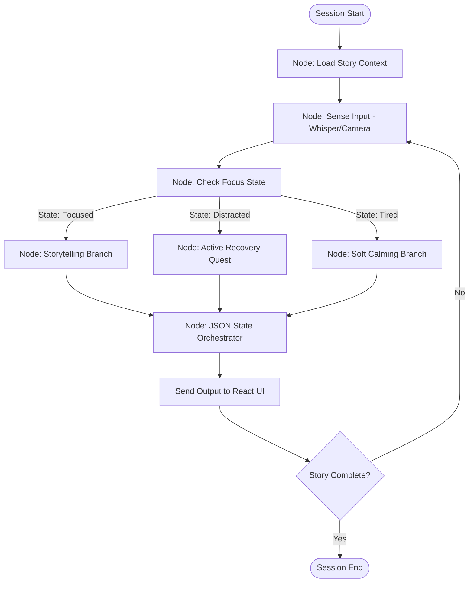

# KathaGemma Multi-Agent Architecture

To deliver an infinitely patient, highly adaptive tutoring experience for young children, KathaGemma employs a **multi-agent orchestration framework**. Rather than placing all reasoning inside a single LLM prompt, we distribute responsibilities across cooperative agents. This separation of concerns ensures low latency, limits hallucinations, and guarantees clean UI routing outputs.

```
       +-------------------------------------------------------------+
       |                         USER CHILD                          |
       +-------+--------------------+---------------------+----------+
               |                    |                     ^
               | Audio (Whisper)    | Camera (Gemma Vis)  | JSON Layout & TTS
               v                    v                     |
       +-------+--------------------+---------------------+----------+
       |            SENSORY PERCEPTION INTERPRETER AGENT             |
       +----------------------------+--------------------------------+
                                    | Transcription / Object Tags
                                    v
       +----------------------------+--------------------------------+
       |            ATTENTION & ENGAGEMENT TRACKER AGENT             |
       +----------------------------+--------------------------------+
                                    | Attention State (Focused/Distracted/Tired)
                                    v
       +----------------------------+--------------------------------+
       |             PEDAGOGICAL GUIDE AGENT (RAG)                   |
       +----------------------------+--------------------------------+
                                    | Context & Text Selection
                                    v
       +----------------------------+--------------------------------+
       |               JSON STATE ORCHESTRATOR AGENT                 |
       +----------------------------+--------------------------------+
                                    | Strictly Validated JSON Frame
                                    v
                               [Client UI]
```

---

## 1. Agent Roles & Specifications

### 🛡️ Sensory Perception Interpreter Agent
*   **Role**: Converts raw sensory signals from the device hardware into semantic text tokens.
*   **Capabilities**:
    *   *EARS (Speech Parsing)*: Feeds microphone stream to a local Whisper instance. Handles multilingual and code-switched inputs (Hinglish/Benglish) using transliteration dictionaries.
    *   *EYES (Vision Encoding)*: Runs inference on captured webcam frames utilizing **Gemma's native vision capability**. Resolves physical object boundaries and matches held items against target quests (e.g., verifying if the child is holding a "green mango leaf" or "toy car").
*   **Inputs**: Raw audio bytes, PIL Camera Images, Canvas sketch SVG path vectors.
*   **Outputs**: Text transcription strings, identified object labels.

### 🧠 Attention & Engagement Tracker Agent
*   **Role**: Analyzes child behavior metrics to continuously evaluate focus levels and trigger distraction-recovery states.
*   **Capabilities**:
    *   *Gaze Tracker*: Reads eye-tracking states from the front-camera API (checking if coordinates focus on the tablet screen).
    *   *Silence Detector*: Tracks the time delta since the last child utterance. If no input is received within 15 seconds, it registers a silence threshold.
    *   *Sentiment/Chatter Analyzer*: Detects verbal distractions. If the child starts talking about toys instead of the story, it flags cognitive drift.
*   **Inputs**: Gaze coordinates, silence timestamp offsets, Whisper transcription text.
*   **Outputs**: State classification: `[focused, distracted, tired, hyper-active, shy_silent]`.

### 📖 Pedagogical Guide Agent (RAG)
*   **Role**: Manages the story progression, curriculum milestone checks, and vocabulary adaptation.
*   **Capabilities**:
    *   *RAG Retrieval*: Queries the local Vector Database (**ChromaDB** containing NCERT Barkha and StoryWeaver content) to extract relevant stories, matching illustrations, and vocabulary-adapted sentences.
    *   *Comprehension Checks*: Generates level-appropriate questions based on the retrieved context.
*   **Inputs**: Current story index, child response transcription, attention state.
*   **Outputs**: Story passage chunk, page illustrations, comprehension question, target vocabulary restrictions (Class I & II reading level).

### ⚙️ JSON State Orchestrator Agent (The Governor)
*   **Role**: Aggregates recommendations from the other three agents, applies formatting logic (enforced by the fine-tuned Gemma LoRA weights), and generates a single structured JSON output to control the frontend UI.
*   **Capabilities**:
    *   *Schema Enforcement*: Ensures the generated output strictly conforms to the JSON schema.
    *   *Error Correction*: If a formatting error occurs during local inference, it runs a self-correction pass or falls back to a safe pre-compiled default schema.
*   **Inputs**: Pedagogical texts, visual quests, child attention state.
*   **Outputs**: Validated JSON payload (containing `spoken_text`, `ui_action`, `ui_params`, `pedagogical_state`, `expected_input`).

---

## 2. Agent State Loops (LangGraph Specifications)

During the hackathon, we represent these agents as nodes inside a **LangGraph** workflow. A state graph is ideal because the user session is cyclic (e.g., the child starts storytelling, gets distracted, recovers via a quest, and returns to storytelling).



### Node Implementations:
1.  `Sense Input`: Captures child input (Whisper transcription / camera frame tag) and updates the global graph state.
2.  `Check Focus State`: Runs rule-based thresholds on response time and uses a fast text classifier to categorize focus.
3.  `Active Recovery Quest`: Sets `ui_action` to `TRIGGER_CAMERA` or `SHOW_CANVAS`, selects a target physical quest (e.g., "Find something green"), and crafts a playful verbal nudge.
4.  `Storytelling Branch`: Queries **ChromaDB** for the next paragraph, fetches the matching page image, and crafts standard narrative speech.
5.  `JSON State Orchestrator`: Pings the Gemma model (with system instructions and QLoRA adapter) to compile the inputs into the strict schema JSON.
