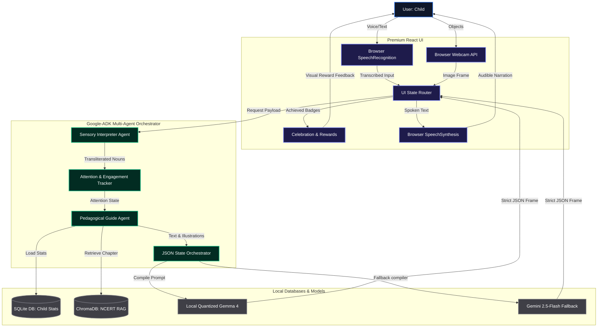

# KathaGemma: Voice-First Adaptive Tutoring System for Bharat

KathaGemma is a voice-first, multimodal, retrieval-augmented tutoring system built on **Gemma** to support early childhood literacy (ages 5–7, Class I & II reading levels) in India. 

Standard text-based AI interfaces fail young learners—particularly neurodivergent children (such as those with ADHD)—who struggle with reading focus and lack a keyboard interface. KathaGemma is designed to act as an infinitely patient, highly encouraging tutor that **speaks, hears, and sees**, using structured JSON states to dynamically transform the user interface based on child behaviors.

---

## 📖 End-to-End Creative Use Case: Aarav's Journey

Let's walk through a typical session of a 5-year-old child named **Aarav** from a village in West Bengal, along with his mother, **Sujata**:

### 1. Initialization (Parent-Device Interaction)
Sujata opens KathaGemma on a low-cost Android tablet. She selects **Bengali-English (Benglish)** as the language framework. 
*   **The AI Greets Aarav (Audio Output)**: "Namaskar Aarav! Today we are reading the story of *Raju and the Elephant*. Look at Raju standing under the big tree!"
*   **The UI Display**: A simple, colorful illustration of Raju under a mango tree is rendered on screen. There are no text boxes, search bars, or complex settings.

### 2. Narrating & Reading (Speech-to-Speech)
KathaGemma reads the first line of the NCERT Barkha story: *"Raju walked to the pond. He saw a small elephant splash in the water!"*
*   **Prompting the Child**: "Aarav, what sound does splash make? Can you say 'Splash! Splash!'?"
*   **The Child Responds**: Aarav shouts: *"Splash splash, look KathaGemma!"*
*   **Ears (Whisper)**: The local Whisper model transcribes the speech. Gemma processes the audio meaning.
*   **Gemma Response**: *"Yes! Splash splash! You sound just like the little elephant!"*

### 3. Distraction Pivot (ADHD Recovery Model)
After 90 seconds, Aarav starts losing interest. He drops the tablet on the table and looks away to grab a red toy car from his bed. 
*   **Gaze Tracking / Speech Silence Detection**: The application notices no speech input for 15 seconds, and the front-facing camera registers that Aarav's eyes are not on the screen.
*   **Structured JSON Output**: The Gemma Brain outputs:
    ```json
    {
      "spoken_text": "Aarav! Let's play a game. Find something green like a leaf in your room, and show it to my camera! Let's help Raju cross the grass!",
      "ui_action": "TRIGGER_CAMERA",
      "ui_params": { "target_prompt": "Find something green" },
      "pedagogical_state": "distraction_recovery",
      "expected_input": "image"
    }
    ```
*   **Frontend UI State Route**: The tablet screen immediately dims the story illustration, pops up a full-screen camera view, and paints a green flashing card prompting Aarav to hold up a green item.
*   **Tactile Engagement**: Aarav gets excited. He drops his toy car, runs to the balcony, picks up a green mango leaf, and holds it up to the tablet screen.
*   **Eyes (Gemma Vision)**: Gemma's vision encoder reads the camera frame (mango leaf) and returns the tag: `"green mango leaf"`.
*   **Gemma Response**: *"Wow, Aarav! That is a green mango leaf! It is perfect! The elephant uses your green leaf as a big umbrella to keep Raju dry from the rain. Let's continue..."*

### 4. Branching & Comprehension
The story advances. KathaGemma asks Aarav a question: *"Should Raju follow the elephant into the forest, or ask him for a ride?"*
*   **Brain Output (`SHOW_CHOICES`)**: Outputs options in the JSON schema.
*   **UI State**: Renders two large, vibrant bubble cards: **[Climb on Back]** and **[Walk in Forest]**. 
*   **Child Touch**: Aarav taps the **[Climb on Back]** bubble.
*   **Result**: The story branches dynamically, showing Raju riding high on the elephant, accompanied by celebratory sound effects.

---

## 🛠️ Unified Architecture & Data Flows

KathaGemma divides responsibilities between three main modules: **Sensory I/O (Ears, Eyes, Voice)**, **The Brain (Gemma + RAG + LoRA)**, and **The UI State Manager**.

```
                +-------------------------------------------------+
                |                  THE USER (CHILD)               |
                +----+-------------------+-------------------+----+
                     |                   |                   ^
      Speech Input   |      Camera Frame |   Touch Bubble    | Audio Playback
      (Whisper)      |      (Gemma Vision) |   Selection       | (TTS Engine)
                     v                   v                   |
               +-----+------+     +------+-----+     +-------+----+
               |    EARS    |     |    EYES    |     |   VOICE    |
               +-----+------+     +------+-----+     +-------+----+
                     |                   |                   ^
                     | Transcribed Text  | PIL Image Bytes   | Spoken Text
                     v                   v                   |
               +-----+-------------------+-------------------+----+
               |                FRONTEND UI ROUTER                |
               |     (Parses incoming structured JSON frames)     |
               +-----+---------------------------------------+----+
                     |                                       ^
                     | Query Frame                           | JSON Frame
                     v                                       |
   +-----------------+---------------------------------------+------------------+
   |                                 THE BRAIN                                  |
   |                                                                            |
   |    +--------------------+     +--------------------+     +-------------+    |
   |    |     RAG CORPUS     |     |    Gemma Weights   |     |    LoRA     |    |
   |    |  (Chroma DB)       +---->|   (Core Inference  +---->|  (Forces    |    |
   |    |  Barkha/StoryWeaver|     |   2B / 4B / 9B)    |     |  JSON Output|    |
   |    +--------------------+     +--------------------+     +-------------+    |
   +-----------------------------------------------------------------------------+
```

### The Data Flow Step-by-Step:
1.  **Speech / Image Capture**: The child talks or holds an object. EARS (Whisper) converts audio to text; EYES (Camera) captures frame pixels.
2.  **RAG Context Augmentation**: The user inputs are combined with story data extracted from the local Vector database (ChromaDB) containing stories from Pratham Books or NCERT Barkha series.
3.  **Brain Reasoning (Gemma LoRA)**: The prompt is sent to Gemma. The fine-tuned QLoRA weights force the model to output *strictly structured JSON* mapping the pedagogical state.
4.  **UI State Routing (The Interface)**: The client application parses the JSON frame received from the brain:
    *   **Audio Pipeline**: The client extracts `spoken_text` and plays it via friendly HTML5 browser **SpeechSynthesis** (reading text aloud and auto-progressing sentences).
    *   **Visual Layout Transition**: Renders camera quests (Webcam API), whiteboards, or vibrant choice bubbles based on `ui_action`.

---

## 📈 Fine-Tuning Gemma to Output Structured JSON & Code-Switch

### 1. JSON Layout Alignment
Zero-shot prompting an LLM can result in formatting failures (e.g., conversational chatter, missing commas, or markdown backticks) which will crash the JSON parser on an edge device. By training QLoRA (Quantized Low-Rank Adaptation) on the Gemma models, we permanently update the adapter weights to output responses according to our schema.

### 2. Regional Dialect Code-Switching (IndicCorpV2)
Young Indian children (ages 5–7) naturally mix regional nouns and verbs into code-switched structures (e.g., Benglish: *"Look at that biral!"* [cat], Hinglish: *"Raju tree ke upar chadha"*). 
We leverage **AI4Bharat's IndicCorpV2** dataset (local Indian languages and transliterated code-mixed texts) to train the model's adapter weights to parse and understand hybrid speech inputs, responding back in a warm, encouraging regional tone.

---

## 🚀 How to Set Up and Run the Unified App

The project contains a unified FastAPI Python server serving a premium React UI frontend.

### 1. Installation

#### Backend Setup
Ensure you are in the root directory `the project root directory`:
```bash
# Activate your python virtual environment
.\venv\Scripts\activate

# Install requirements
pip install -r requirements.txt
```

#### Frontend Setup
```bash
cd KathaGemmaUI/frontend
npm install
```

### 2. Configuration & Environment Variables

#### Backend `.env` (`./.env`):
Create a `.env` file in your root workspace:
```env
GEMINI_API_KEY=your_gemini_api_key_here
BASE_URL=http://localhost:8000
USE_LOCAL_LORA=1
```
*   `GEMINI_API_KEY`: Google AI studio key (used for low-latency demonstration fallback and camera vision analysis).
*   `BASE_URL`: Base address of your server (used to rewrite static local image asset paths so they render in the React app).
*   `USE_LOCAL_LORA`: If set to `1` and `./kathagemma_lora_weights` directory is present, the app will load the local fine-tuned **Gemma 4 model** for core reasoning.

#### Frontend `.env` (`./KathaGemmaUI\frontend\.env`):
Create a `.env` file in the frontend folder:
```env
VITE_API_URL=http://localhost:8000/api
```
This points the React application to your FastAPI backend port.

### 3. Running the Dev Mode (Two Terminals)

*   **Terminal 1 (Start Python FastAPI Backend)**:
    ```bash
    python app.py
    ```
    Exposes endpoints and DB manager on `http://localhost:8000`.

*   **Terminal 2 (Start React Dev Client)**:
    ```bash
    cd KathaGemmaUI/frontend
    npm run dev
    ```
    Launches the hot-reloading dev UI on `http://localhost:5173`. Open this URL in your web browser.

### 4. Running the Compiled Production Bundle (Single Port)
For staging or a live presentation demo, you can build the React app and serve it directly from the Python backend on a single port (`8000`):

1.  Compile the React app:
    ```bash
    cd KathaGemmaUI/frontend
    npm run build
    ```
    This outputs the compiled HTML/JS/CSS assets into the `dist/` directory.
2.  Launch the backend server:
    ```bash
    cd ../..
    python app.py
    ```
3.  Open the web browser to:
    ```
    http://localhost:8000/
    ```
    The FastAPI backend will automatically mount and serve the gorgeous React app!

---

## 🗃️ Persistent Database & Stats

The backend uses a local **SQLite database** located in `dataset/kathagemma_data.db`. It handles:
*   **Child Profile**: XP points, daily streaks, levels, and unlocked badges.
*   **Active Stories**: Active story index, selected paths, and generated chapters.
*   **Voice/Camera logs**: History of conversation logs and scanned scavenger items.

---

## 📊 End-to-End API & Model Mapping Table

This table outlines which APIs and Models (Gemma, Gemini, Whisper, browser services) are triggered at each screen of the **KathaGemmaUI** React application during live runs:

| Feature Screen | Input Channel / API | Core Reasoning / NLP Model | Output Channel / API |
| :--- | :--- | :--- | :--- |
| **Welcome / Login** | React mouse clicks (saved to `localStorage`). | *None (Local UI state)* | Renders avatar/stats screen. |
| **Home Screen** | `GET /api/story/child/:childId/profile` loading from **SQLite Database**. | *None (Database lookup)* | Displays XP, streak, achievements. |
| **Story Read (Start)** | `POST /api/story/start` sending prompt text to Python. | **Gemma 4 (Local LoRA)** (or Gemini API fallback) + **ChromaDB RAG** story query. | Renders illustration + text. Reads aloud via browser **SpeechSynthesis** (TTS). |
| **Story Read (Continue)** | `POST /api/story/continue` sending selected path to Python. | **Gemma 4 (Local LoRA)** (or Gemini API fallback) + **ChromaDB RAG** next chapter query. | Renders next chapter. Reads aloud via browser **SpeechSynthesis** (TTS). |
| **Voice Assistant** | Browser microphone via **HTML5 `SpeechRecognition`** API. | **Gemma 4 (Local LoRA)** (or Gemini API fallback) compiling conversational response. | Renders subtitles. Reads response aloud via browser **SpeechSynthesis** (TTS). |
| **Camera (Quest Hunt)** | Device webcam via browser **Webcam API** capturing target image. | **Gemini Vision API** (compares base64 image bytes to verify target e.g. "green leaf"). | Unlocks badge in **SQLite Database** + alerts UI. |

---

## 🧠 Multi-Agent Orchestration & Graph Architecture

To deliver an infinitely patient, highly adaptive tutoring experience for young children, KathaGemma employs a **cooperative multi-agent orchestration framework** (represented as cyclic nodes in a LangGraph workflow). This prevents reasoning hallucinations, limits latency, and guarantees clean UI routing outputs.

```
       +-------------------------------------------------------------+
       |                         USER CHILD                          |
       +-------+--------------------+---------------------+----------+
               |                    |                     ^
               | Audio (SpeechRecog) | Camera (Webcam API) | JSON Layout & TTS
               v                    v                     |
       +-------+--------------------+---------------------+----------+
       |            SENSORY PERCEPTION INTERPRETER AGENT             |
       +----------------------------+--------------------------------+
                                    | Transcription / Object Tags
                                    v
       +----------------------------+--------------------------------+
       |            ATTENTION & ENGAGEMENT TRACKER AGENT             |
       +----------------------------+--------------------------------+
                                    | Attention State (Focused/Distracted/Tired)
                                    v
       +----------------------------+--------------------------------+
       |             PEDAGOGICAL GUIDE AGENT (RAG)                   |
       +----------------------------+--------------------------------+
                                    | Context & Text Selection
                                    v
       +----------------------------+--------------------------------+
       |               JSON STATE ORCHESTRATOR AGENT                 |
       +----------------------------+--------------------------------+
                                    | Strictly Validated JSON Frame
                                    v
                               [Client UI]
```

### 📊 Cyclic Orchestration Flow Diagram



### Agent Roles & Loop States:
1. **Sensory Interpreter Agent**: Converts raw sensory signals from Whisper/Webcam into semantic text tokens. Resolves transliterated code-switched phrases (Hinglish/Benglish) using local dictionaries.
2. **Attention & Engagement Tracker**: Evaluates silence intervals, sentiment drift, and eye-tracking gaze states. If the child gets distracted for $>15$s, it flags a `distracted` state.
3. **Pedagogical Guide Agent (RAG)**: Queries the local vector database (**ChromaDB** with NCERT Barkha and StoryWeaver contents) to pull vocabulary-aligned paragraphs and corresponding page illustrations.
4. **JSON State Orchestrator Agent (The Governor)**: Compiles all choices, illustrations, and spoken texts into a single strict JSON schema format enforced by our fine-tuned LoRA weights.

---

## 📡 Edge Deployment & Low-Cost Hardware Optimization

KathaGemma is built to operate **entirely offline on device edge hardware** (such as low-cost Android tablets, school laptops, or Raspberry Pi setups in rural areas):

* **4-Bit NF4 Quantization**: By loading the Gemma model in quantized mode, it only requires **~2.2 GB of memory** (VRAM), making it runnable on cheap, GPU-constrained tablets or edge accelerators.
* **Offline Local Databases**: RAG uses a local SQLite database for child stats/profile logs and a local ChromaDB instance for story indexing. It requires no cloud subscriptions or active cellular connections to read, track progress, or retrieve stories.
* **Hardware Native TTS/STT**: Audio playback and voice detection utilize browser-native SpeechSynthesis and SpeechRecognition APIs, requiring 0% cloud APIs or network overhead.

---

## ⚠️ Challenges, Limitations & Future Scope

While the hybrid multi-agent approach is highly resilient, the following challenges remain:

* **GPU Quantization Overhead on Edge**: On highly resource-constrained devices, local LLM generation latency can be slow. A lightweight C++ runner (like `llama.cpp` or `vLLM`) can be used to optimize inference speed.
* **Ambient Noise in Classrooms**: Rural environments and classrooms contain high background noise. Integrating an on-device noise suppression algorithm before passing audio to Whisper is critical.
* **Illustrative Grounding limits**: While illustrations are grounded in NCERT databases, generating *new* branching story images dynamically on the edge is currently unfeasible due to the weight of image-generation models. We mitigate this by matching illustration metadata from our pre-indexed NCERT Barkha image store.
